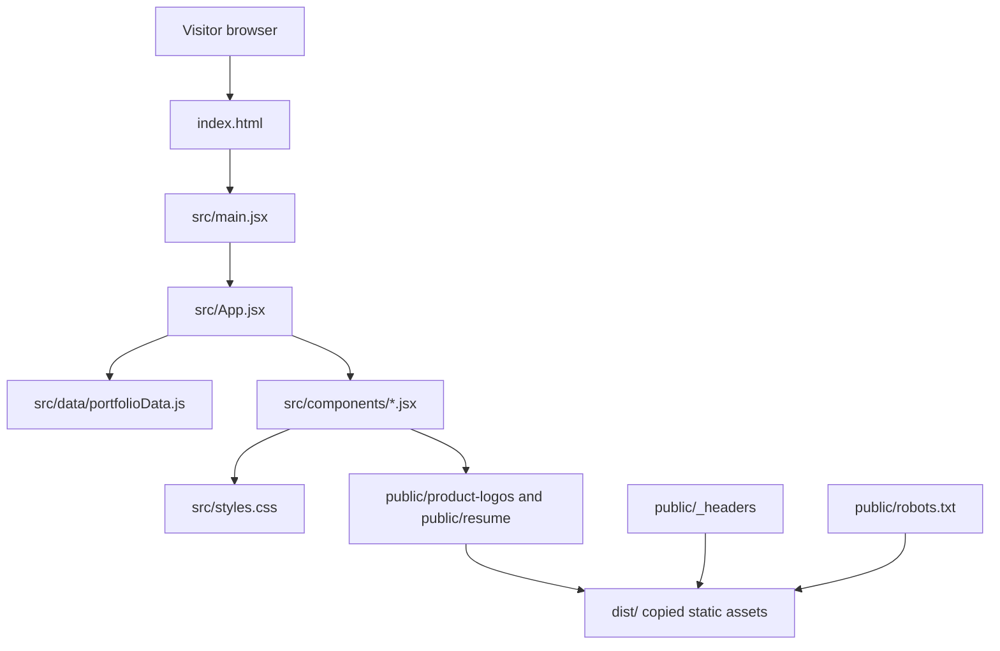

# Architecture

## High-Level Architecture

This repository is a Vite-powered React single-page static site. Vite builds the app into static files under `dist/`. The deployed site can be hosted on static hosting providers such as Cloudflare Pages.

There is no backend process, API server, database, authentication system, server-side rendering, service worker, or runtime storage layer in the current repository.

## Entry Points

| File | Role |
| --- | --- |
| `index.html` | HTML shell, page metadata, noindex meta tags, and script entry. |
| `src/main.jsx` | React root mounting point. |
| `src/App.jsx` | Main page composition and section order. |
| `src/data/portfolioData.js` | Source of truth for navigation labels, product data, resume links, GitHub cards, and contact items. |
| `src/styles.css` | Global styling, layout, responsive behavior, and component classes. |

## Major Modules

| Module | Purpose |
| --- | --- |
| `Navbar.jsx` | Sticky top navigation and profile icon links. |
| `Hero.jsx` | First-screen positioning, CTA buttons, and product-builder signal cards. |
| `SectionHeader.jsx` | Shared section heading component. |
| `ProductCard.jsx` | Compact product cards with logo or placeholder artwork, tech chips, source note, and case-study anchor. |
| `ProductDetail.jsx` | Detailed case study sections with highlights, tech stack, and source-code note. |
| `ResumeCard.jsx` | Resume download cards using normal anchor downloads. |
| `ContactCard.jsx` | Contact/profile/location cards. |
| `Footer.jsx` | Footer and back-to-top link. |

## Data Flow

1. `src/data/portfolioData.js` exports arrays and objects.
2. `src/App.jsx` imports that data and maps it into reusable components.
3. Components receive data as props.
4. Components render static markup and links.
5. CSS classes in `src/styles.css` control layout, spacing, colors, responsive behavior, and hover states.

The app does not fetch remote data at runtime.

## State Flow

The current app has no React state hooks, global state manager, context provider, or local persistence. Rendering is deterministic based on static data imports.

## Persistence and Storage

No browser storage, database storage, cookies, localStorage, sessionStorage, or server persistence is used by this website.

Static files in `public/` are copied into `dist/` during `npm run build`.

## External Integrations

| Integration | How it appears |
| --- | --- |
| GitHub profile | External links to `https://github.com/ShauryaDas924`. |
| LinkedIn profile | External links to `https://www.linkedin.com/in/shauryadas/`. |
| Email | `mailto:` link in contact data. |
| Cloudflare Pages headers | `public/_headers` for `X-Robots-Tag` noindex headers. |

No analytics or tracking integrations are present in the repo.

## Security Model

This site is static and public to anyone with the link. The security model is primarily about not publishing sensitive material.

Important boundaries:

- Do not add private source code.
- Do not add secrets, API keys, tokens, environment files, certificates, logs, database dumps, or private local paths.
- Do not add public source-code links for private products.
- Do not add analytics or tracking without explicit approval.
- Treat resume PDFs as public once placed in `public/resume/`.

## Permission Model

The portfolio website itself requests no browser permissions.

Some product case studies describe browser extensions, native macOS helpers, privileged helpers, LaunchAgents, LaunchDaemons, iOS Keychain, authentication, or AI systems. Those are descriptions of other projects and are not implemented in this repository.

## Error Handling Patterns

The main explicit UI fallback is in `ProductCard.jsx`: product logo image errors hide the image and show the preview label fallback by adding a `logo-failed` class to the preview container.

Other links and content are static. There is no runtime error boundary or network error handling in the current repo.

## Background Jobs, Timers, and Schedulers

None in this portfolio website.

## Platform-Specific Architecture

No platform-specific native code is included. Platform-specific behavior appears only in product descriptions and case studies.

## Deployment and Search Indexing

Vite copies `public/robots.txt` and `public/_headers` into `dist/`. The current noindex strategy includes:

- Meta noindex tags in `index.html`.
- `public/robots.txt` with `Disallow: /`.
- Cloudflare Pages `X-Robots-Tag` headers in `public/_headers`.

This discourages normal search indexing but does not protect access. Direct-link visitors can still view the site.
